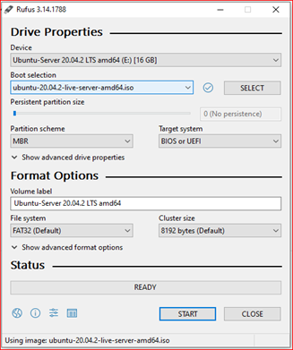

# Installing Ubuntu 20.04 LTS (Focal Fossa) with 2 disks in a RAID 1 configuration
Author : Vhuli Manukha

Date : 24/05/2021

<!-- <table>
    <tr>
        <td>Foo</td>
    </tr>
</table> -->

## Introduction
In this article we will demonstrate Ubuntu 20.04 LTS server installation steps (for raid 1 setup) with screenshots. Before initiating the Installation process, let us see what minimum system requirements for Ubuntu 20.04 LTS Server installation are.
1.  4 GB Memory (RAM)
2.  Dual Core Processor
3.  25 GB Hard Disk Space
4.  Bootable Media (USB / DVD)
5.  Stable Internet Connection

## Instructions
Let us assume I have a server which has two hard disks ( I TB each ) on which we will be installing Ubuntu 20.04 LTS server and create software RAID 1.

Steps:
1. [Download the ISO](#step-1-download-the-iso-file)
2. [Create a bootable drive](#step-2-create-a-bootable-drive)
3. [Boot into the target system](#step-3-boot-into-the-target-system)
4. [Basic setup](#step-4-basic-setup)
5. [Partition the storage space](#step-5-partition-the-storage-space)

### Step 1) Download the ISO file
1. Download ISO file of Ubuntu 20.04 LTS server using following URL: https://ubuntu.com/server 
2. Save the ISO file somewhere you can easily find it again, like your Downloads, Documents or Desktop folder.
3. Once ISO file is downloaded on your system then make a bootable USB drive or DVD.

### Step 2) Create a bootable drive
To create the installation medium, we will use a Flash Drive for this since none of the servers we are using currently have a DVD drive. There are several ways of doing this, but for our convenience we will just download and use the Rufus (windows) media creation tool. It is easy to use and less prone to errors than manually configuring the bootable drive.
The steps below will take you through the setup step-for-step:
1. Follow this link on your Windows PC:  https://rufus.ie/en_US/. Download the latest version of the Rufus tool (this manual uses rufus-3.14)
2. Insert the flash drive into your PC.
3. Run the rufus-3.14 executable file.
4. Select the device you want to create the bootable media on (the flash drive is selected automatically if it is the only one attached). 
5. Under Boot selection, select ISO image. Click on the SELECT button, browse to where you saved the ubuntu server ISO file, select it, and click the Open button.
6. Under Partition scheme, select MBR.
7. Under Target system, select BIOS or UEFI.
8. Do not change anything under the advanced drive properties.
9. Leave the volume label as is.
10. The File system should be specified as Large FAT32.
11. Do not change anything under the advanced format options.
12. Click on the START button.
13. You might see a Download required window appear. click Yes.
14. After the missing libraries have been downloaded, you will see an ISO Hybrid image detected window appear, select the Write in ISO Image mode (Recommended) option, and click OK.
15. A window will now appear warning you that everything that is currently on that disk will be erased. After making sure there is nothing valuable on the flash drive, you can click OK.
16. Wait for Rufus to finish creating the Bootable Flash Drive and safely remove the flash drive from your PC.


<figcaption>

*Figure 1: Creating Bootable Flash Drive.*

</figcaption>


### Step 3) Boot into the target system
Insert the Bootable Flash Drive into the target system on which you want to install Ubuntu 20.04 LTS server and reboot the target system (we are using supermicro). On reboot go to its bios settings (by pressing F11 for Supermicro PC) and change boot medium from disk to bootable media (Flash drive). UEFI: Generic Flash Disk 8.07. partition 1 in our case
 
Figure 2: Booting from Flash Drive

### Step 4 ) Basic Setup

Once the system boots up, we will get the following screen. 
1.  Navigate to Install Ubuntu Server using the arrow keys and press enter to select.
 
Figure 3:Screenshot of basic setup: Step 1


2.  Select English as the language and press enter.
 
Figure 4: Screenshot of basic setup: step 2
3.  Choose keyboard layout and then choose “Done” option and hit enter.
 
Figure 5: Screenshot of basic setup: step 3


4.  Configure network and Ubuntu Archive Mirror.
•   If your system is connected to the network, then in the next screen you will see that interface (Ethernet Card) has automatically pick the IP via DHCP. In case you have multiple Ethernet cards then you have option to create a bond interface. Choose “Done” and hit enter.
 
Figure 6: Screenshot of basic setup: step 4.1
•   If your system is connected to network and running behind the proxy server (i.e., for getting internet), then specify the proxy IP and port else leave as it is and press enter.
 
Figure 7: Screenshot of basic setup: step 4.2
•   In the next screen, based on the country location. Installer will automatically configure Ubuntu archive mirror. Choose “Done” and hit Enter to proceed.
 
Figure 8: Screenshot of basic setup: step 4.3
5.  Configure Storage Layout for Ubuntu 20.04 LTS server.
In this step, we will be presented a screen where we need to decide how you want to configure storage layout for Ubuntu 20.04 server installation. Here you have two options,
   Use an entire disk – In case, you want installer to automatically create partitions for you, then choose option.
   Custom Storage layout – In case, you want to create your own customized partition scheme or table then choose this option.
In this guide, we will create our own customized partitions scheme by choosing the 2nd option.

### Step 5) Partition the storage space
1.   Select "Custom storage layout" when you reach the storage configuration step of the installer and choose “Done” and hit Enter to proceed.
 
Figure 9: Screenshot of advanced setup: step 1
2.  If the disks have existing partitions, click on each disk under AVAILABLE DEVICES and then select REFORMAT. This will (temporarily) wipe out the partitions.
3.  Mark both drives as a boot device. Doing so will create an ESP (EFI system partition) on both drives.
•   Select the 1st Disk to add as "boot" disk (same menu that had REFORMAT in).  Navigate to “Use as Boot Device” and press enter.
 
Figure 10: Screenshot of drive partition setup: step 2(a)
•   Note the EFI system partition created on 1st Disk. The Disk space should also change from unused to free space.

 
Figure 11: Screenshot of drive partition setup: step 2(b)
•   Select 2nd Disk and repeat the same setup on the 2nd Disk and when setup done pay attention to the pointers.
 
Figure 12: Screenshot of drive partition setup: step 2(c)
4.  Add an unformatted GPT partition to both drives. They need to have the same size. We are going to use those partitions for the RAID that contains the OS.
•   Select the 1st Disk to add as "leave unformatted" Disk (same menu that had REFORMAT : Add GPT Partition=>Size: do not allocate space => format : leave unformatted=>Mount : / => choose to “Create” and hit enter). 
 
Figure 13: Screenshot of drive partition setup: step 3(a)
•   Note that partition 2 created with unformatted (unused) space on 1st  Disk. 
 
Figure 14: Screenshot of drive partition d setup : step 3(b)
•   Select the 2nd  Disk to add as "leave unformatted" disk (same as above). And when done you will notice that both drives have partition 2 added.
 
Figure 15: Screenshot of drive partition setup: step 3(c)

### Step 6) Creating Software RAID 1 system
1.  Navigate to “Create software RAID (md)” and hit enter. 

 
Figure 16: Screenshot of raid setup : step 1 

2.  Then navigate and  select both partitions created  for the OS by pressing space bar (it will be marked with x) and then choose “Create” and hit enter.
 
Figure 17: Screenshot of raid setup: step 2 
3.  Congratulations, you now have a new RAID device.
 
Figure 18: Screenshot of raid setup: step 3


4.   Let us add at least one GPT partition to it. 
 
Figure 19: Screenshot of raid setup: step 4(a)
•   Optional: If you want the ability to swap, create a swap partition on the RAID device. Set the size to the same as your RAM, or half if you have 64 GB or more RAM.
 
Figure 20: Screenshot of raid setup: step 4(b)
•   Note new swap partition  created on RAID1.
 
Figure 21: Screenshot of raid setup : step 4(c)
5.  Create a partition for Ubuntu on the RAID device. You can use the remaining space if you want to. Format it as ext4 and mount it at /.
 
Figure 22:Screenshot of raid setup: step 5(a)
 
Figure 23:Screenshot of raid setup: step 5 (b)

6.  All these mdX soft RAID partitions will now appear under USED DEVICES and you are ready to proceed with Ubuntu's installation.
•   At the very bottom, you should now see "Done" enabled so hit it and proceed. What partitioning of disks when installing Ubuntu on software raid might look like. Save the changes and continue along with the installation.
 
Figure 24: Screenshot of raid setup : step 6 


### Step 7) Finalising the setup
1.  Choose to continue to write changes into the disk and to proceed with installation,
 
Figure 25: Screenshot of final setup: step 1
2.  Specify hostname and local user details.

•   In this step, you need to specify the local user details and Host name that you want to set for your server. So, enter the details that suits to your installation. Choose “Done” and hit enter.
 
Figure 26: Screenshot of final setup: step 2

3.   Choose to install OpenSSH server Package.

•   In case you want to access your server over network using ssh then it is recommended to install openssh server package during installation. So, choose “Install OpenSSH server” option and then hit enter.
 
Figure 27: Screenshot of final setup: step 3(a)
•   In the next screen, you have an option to choose the snaps for your server environment and if you do not want to install any snap during the installation then do not choose any snap and just choose Done and press enter to start the installation.
 
Figure 28: Screenshot of final setup: step 3(b)


4.  Ubuntu 20.04 Server Installation Started

•   As we can see below, installation of Ubuntu 20.04 LTS server has been started and is in progress.
 
Figure 29: Screenshot of final setup: step 4(a)
•   Once the installation is completed, installer will prompt to reboot the system. Choose ‘Reboot’ and hit enter.
 
Figure 30: Screenshot of final setup: step 4(b)
Note: Do not forget to change boot medium from bootable media to disk so that system boots up with the disk on which we have just installed Ubuntu 20.04 LTS Sever


5.   Login after successful installation and verify OS version.
Once the system is available after reboot, use the local user credentials that we have created during the installation for login.
 
Figure 31: Screenshot of final setup: step 5
Perfect, this confirms that Ubuntu 20.04 LTS server is installed successfully on our system.

## GUI/Desktop  Installation

Step 1) Run the following command.

1.  $ sudo apt update
2.  $ sudo apt install gnome-shell ubuntu-gnome-desktop -y

Step 2) Once Gnome desktop packages are installed successfully then reboot your server and you will get following login screen.

3.  $ sudo apt update && sudo apt upgrade -y
4.  $ sudo apt install ubuntu-restricted-extras


 
Figure 32: Screenshot of GUI setup : step 1


## Handling the raided booting
Software RAID has been relatively simple to use for a long time as it mostly just works. Things are less straightforward when using UEFI as you need an EFI partition that cannot be on a software RAID.
Well, you could put the EFI partition in a software RAID if you put the metadata at the end of the partition. That way the beginning of the partition would be the same as without RAID. The issue with this is if something external writes to the partition as you cannot be sure which drive has the correct state. That is why we are going to use another approach.
Instead of putting it on a RAID, we will install Ubuntu as usual, and then copy the EFI partition over to the second drive. Then we will make sure that either of the two hard drives can go away without affecting the ability to run or boot. We are going to use the efibootmgr tool to make sure both drives are in the boot-list. We will also add some info on how to handle drive replacements and updates affecting EFI.  So, let us get on with it. run the following command:

### Step 1) Avoid slow boot.
Remove btrfs-progs to speed up the boot process in case of a drive failure:
$ sudo apt purge btrfs-progs


### Step 2) Make sure both drives are bootable.
You can check the status of the RAID by running the following:
$ sudo mdadm --detail /dev/md0
If the RAID has completed syncing, you will be able to crash or remove one drive and run off the remaining hard drive. However, while this is fine, there is one potential lurking issue. If you remove one drive, you might be unable to boot the system. So, let us make sure the ESP is the same on both drives, and that the system will try to boot from either of the hard drives and not just one. Ubuntu’s installer should have taken care of this for you, but feel free to check.

### Step 3) First, show the partition UUIDs:
$ ls -la /dev/disk/by-partuuid/
drwxr-xr-x 2 root root 120 Oct 1 22:43 .
drwxr-xr-x 7 root root 140 Oct 1 22:43 .
lrwxrwxrwx 1 root root 10 Oct 1 22:43 04d1fc28-4747-497b-9732-75f691a7ae7a -> ../../sdb2
lrwxrwxrwx 1 root root 10 Oct 1 22:43 0577b983-cf0a-4516-a3ab-92e19c3e9afe -> ../../sda1
lrwxrwxrwx 1 root root 10 Oct 1 22:43 97eecdcd-8ec3-4b8e-a6d9-1114d3baa75b -> ../../sda2
lrwxrwxrwx 1 root root 10 Oct 1 22:43 98d444f0-df7f-41d9-8461-95ca566bd3a7 -> ../../sdb1
Take note of the UUIDs belonging to the first partition on both drives. In this case, it is the ones starting with 0577b983(sda1) and 98d444f0(sdb1).

### Step 4) Next, check what drive you are currently using:
$ mount | grep boot
/dev/sdb1 on /boot/efi type vfat (rw,relatime,fmask=0022,dmask=0022,codepage=437,iocharset=iso8859-1,shortname=mixed,errors=remount-ro)
As you can see, we are currently using sdb1, so that is working. Let us copy it over to sda1:
$ sudo dd if=/dev/sdb1 of=/dev/sda1

### Step 5) Now we have a working ESP on both drives, so the next step is to make sure both ESP exists in the boot-list:
$ efibootmgr -v
BootCurrent: 0005
Timeout: 0 seconds
BootOrder: 0001,0005,0006,0000,0002,0003,0004
Boot0000* UiApp FvVol(7cb8bdc9-f8eb-4f34-aaea-3ee4af6516a1)/FvFile(462caa21-7614-4503-836e-8ab6f4662331)
Boot0001* UEFI VBOX CD-ROM VB2-01700376 PciRoot(0x0)/Pci(0x1,0x1)/Ata(1,0,0)N…..YM….R,Y.
Boot0002* UEFI VBOX HARDDISK VBf2f22214-890bfc65 PciRoot(0x0)/Pci(0xd,0x0)/Sata(0,65535,0)N…..YM….R,Y.
Boot0003* UEFI VBOX HARDDISK VB7e066f6b-0343c49a PciRoot(0x0)/Pci(0xd,0x0)/Sata(1,65535,0)N…..YM….R,Y.
Boot0004* EFI Internal Shell FvVol(7cb8bdc9-f8eb-4f34-aaea-3ee4af6516a1)/FvFile(7c04a583-9e3e-4f1c-ad65-e05268d0b4d1)
Boot0005* ubuntu HD(1,GPT,98d444f0-df7f-41d9-8461-95ca566bd3a7,0x800,0x100000)/File(\EFI\ubuntu\shimx64.efi)
Boot0006* ubuntu HD(1,GPT,0577b983-cf0a-4516-a3ab-92e19c3e9afe,0x800,0x100000)/File(\EFI\ubuntu\shimx64.efi)
You should see two entries called Ubuntu. Make sure the UUIDs are the same as the two you took note of earlier.

### Step 6) If an entry is missing, you will need to add it.
Example of how to add an entry for the UUID starting with 0577b983(sda1) if it is missing:
$ sudo efibootmgr --create --disk /dev/sda --part 1 --label "ubuntu" –loader "\EFI\ubuntu\shimx64.efi"

You should now be able to remove any of the two drives and still boot the system.

### Step 7) Adding a fresh drive after a failure.
So, a drive has failed, and you have replaced it with a new one. How do you set it up?
First, find the new drive:
``` bash
$ sudo fdisk -l
```
It is probably one without any partitions. Make sure you are using the right drive. In my case, it’s /dev/sdb, so I will want to back up the partition table from /dev/sda and write it to /dev/sdb. Change the source to the existing drive and does not to the new one:
``` bash
$ source=/dev/sda
$ dest=/dev/sdb
```
Create a backup in case you mix it up:
$ sudo sgdisk --backup=backup-$(basename $source).sgdisk $source
$ sudo sgdisk --backup=backup-$(basename $dest).sgdisk $dest
Create a replica of the source partition table and then generate new UUIDs for the new drive:
$ sudo sgdisk --replicate=$dest $source
$ sudo sgdisk -G $dest
Start syncing the raid, replace the X with the correct partition(it’s 2 for me):
$ sudo mdadm --manage /dev/md0 -a $(echo "$dest"X)
Now, copy over the ESP(replace X with the correct partition, it is 1 for me):
$ sudo dd if=$(echo "$source"X) of=$(echo "$dest"X)
Then list the current drive UUIDs:
$ ls -la /dev/disk/by-partuuid/
Then show the boot-list:
$ efibootmgr -v
Take note of the BootOrder in case you want to change it. If any of the ubuntu entries points to a UUID that currently do not exist, delete it(replace XXXX with the ID form the boot-list):
$ sudo efibootmgr -B -b XXXX
If any of the current UUIDs for partition 1 on the drives do not exist in the boot-list, add it(replace the X with the drive that is missing):
$ sudo efibootmgr --create --disk /dev/sdX --part 1 --label "ubuntu" --loader "\EFI\ubuntu\shimx64.efi"
Verify that it is correct:
$ efibootmgr -v
All good? Great! You now have a working RAID again.
……………………………………………………………………………………..
Reference: 
https://www.linuxtechi.com/ubuntu-20-04-lts-server-installation-guide/
https://alexskra.com/blog/ubuntu-20-04-with-software-raid1-and-uefi/

